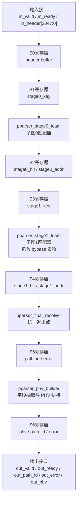

# 当前严格级联版 Parser 架构

这版 RTL 对齐的是论文里更关键的“子图级联、统一退出点”语义，而不是短路径提前退出的简化版本。

它有 3 个核心特征：

- 所有数据包都固定经过 `subgraph0 -> subgraph1 -> final_resolver -> phv_builder`
- 短路径不会在 `stage0` 提前退出，而是在 `stage1` 命中一个 `bypass` 表项
- 最终 `path_id` 和 `error` 统一在 `final_resolver` 里产生

---

## 1. 数据包解析流程

```mermaid
flowchart LR
    A["输入包头<br/>in_header (2048b)"]
    B["S0_buffer<br/>锁存包头"]
    C["S1_key0<br/>提取 EtherType"]
    D["S2_lookup0<br/>子图0匹配<br/>Stage0 T-CAM"]
    E["S3_key1<br/>统一提取 Stage1 key<br/>MPLS1 + MPLS2"]
    F["S4_lookup1<br/>子图1匹配<br/>Stage1 T-CAM"]
    G["S5_final_resolver<br/>统一路径决策"]
    H["S6_phv<br/>构造 512b PHV"]
    I["输出接口<br/>out_path_id / out_error / out_phv"]

    A --> B --> C --> D --> E --> F --> G --> H --> I

    D -. "短路径也继续前进" .-> E
    F -. "短路径在此命中 bypass 项" .-> G
```

### 解析流程说明

1. `Stage0` 先从 `EtherType` 判断顶层协议类别。
2. 不管是短路径还是长路径，报文都不会在这里退出。
3. `Stage1` 统一再看第二级协议特征：
   - 对 MPLS 长路径，识别 `IPv4 / IPv6 / EoMPLS / 双层 MPLS`
   - 对短路径，命中一个 `bypass` 项，只表示“这一包没有第二子图负担”
4. `final_resolver` 把 `stage0` 和 `stage1` 的结果组合成最终 `path_id`
5. `phv_builder` 按最终路径提取字段并拼成 `PHV`

---

## 2. Parser 模块架构

### 模块分工

- `pparser_stage0_tcam`
  负责第一子图匹配，只根据 `EtherType` 给出顶层协议类别

- `pparser_stage1_tcam`
  负责第二子图匹配，对所有包统一执行

- `pparser_final_resolver`
  不直接提取字段，只负责把多子图结果合成为最终路径编号

- `pparser_phv_builder`
  根据最终 `path_id` 选择字段布局，构造固定宽度 `PHV`

---

## 3. 子图级联语义

这版实现的关键不是“能解析”，而是“退出语义和论文更一致”。

### 短路径

- 例如 `Eth -> IPv4`、`Eth -> IPv6`
- `stage0` 已经知道它属于短路径
- 但不会提前结束
- 仍然进入 `stage1`
- `stage1` 命中 `bypass`
- 最终由 `final_resolver` 决定输出 `path 0/1`

### 长路径

- 例如 `Eth -> MPLS -> IPv4`
- `stage0` 先识别出 `MPLS`
- `stage1` 再进一步区分具体后继协议
- `final_resolver` 最终输出 `path 2..7`

### 错误路径

- 任一子图未命中
- 或两级结果组合非法
- 最终输出：
  - `path_id = 4'hF`
  - `error = 1`

---

## 4. 路径映射关系

| path_id | 协议路径 |
|---|---|
| 0 | `Eth -> IPv4` |
| 1 | `Eth -> IPv6` |
| 2 | `Eth -> MPLS -> IPv4` |
| 3 | `Eth -> MPLS -> IPv6` |
| 4 | `Eth -> MPLS -> MPLS -> IPv4` |
| 5 | `Eth -> MPLS -> MPLS -> IPv6` |
| 6 | `Eth -> MPLS -> EoMPLS` |
| 7 | `Eth -> MPLS -> MPLS -> EoMPLS` |
| F | `error path` |

---

## 5. 当前时序特征

- 固定流水线延迟：`7 cycles`
- 启动间隔：`1 cycle`
- 所有数据包都固定走完整条级联链路

---

## 6. 与早期版本相比的变化

早期版本的行为更像“条件级联”：

- 短路径在 `stage0` 后可提前定案
- 长路径才真正进入 `stage1`

当前版本改成“严格级联”后：

- 短路径和长路径都统一经过两个子图
- 所有包只有一个统一退出点
- 更接近论文中“子图级联 parser”的结构表达
